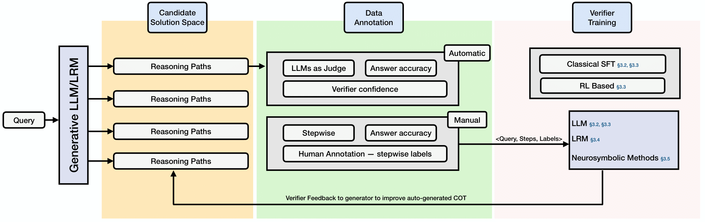
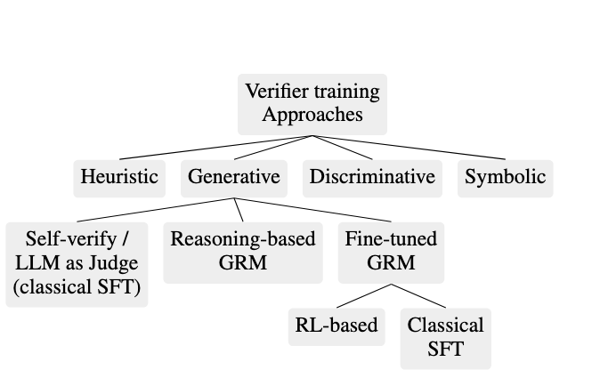

<header>

<!--
  <<< Author notes: Course header >>>
  Include a 1280×640 image, course title in sentence case, and a concise description in emphasis.
  In your repository settings: enable template repository, add your 1280×640 social image, auto delete head branches.
  Add your open source license, GitHub uses MIT license.
-->

<h1>Survey of Verifier Design Mechanisms for Test Time Scaling of LLMs</h1>

  
  
  

Our repository, **Survey of Verifier Design Mechanisms for Test Time Scaling of LLMs**, gathers available papers on different approaches for design and training of verification mechanisms for test-time scaling. To the best of our knowledge no comprehensive survey  Unlike other repositories that categorize papers, we decompose each paper's contributions based on the taxonomy provided by [""]() facilitating easier understand and comparison for readers.

  
  
<b>Figure 1:</b> A Visual Map and Comparison.

## 📢 News and Updates
- **[15/Aug/2025]** 📌 Our repository is created.

## 📘 Introduction
Test-time scaling (TTS) has emerged as a new frontier for scaling the performance of Large Language Models. In test-time scaling, by using more computational resources during inference, LLMs can improve their reasoning process and task performance. Several approaches have emerged for TTS such as distilling reasoning traces from another model or exploring the vast decoding search space by employing a verifier. Employing external verifiers or self-verification is crucial for test-time scaling, as they help guide the search process over large reasoning space. Verification for test-time scaling entails  mechanisms or scoring functions used to evaluate the quality or plausibility of different reasoning paths or solutions from the language model during inference, enabling efficient search or selection among them without access to ground-truth labels.  This paradigm commonly termed has emerged as a superior approach owing to parameter free scaling at inference time and high performance gains. The verifiers could be prompt-based, fine-tuned as a discriminative or generative model to verify process paths, outcomes or both. Despite their widespread adoption, there is no detailed collection, clear categorization and discussion of diverse verification approaches and their training mechanisms. In this survey, we cover the diverse approaches in the literature and present a unified view of verifier training, types and their utility in test-time scaling.

  
  
<b>Figure 2:</b> Taxonomy for Verification Design and Training mechanisms.</i>.

## 🔍 Overview of Works

## Generative Verifiers

### Classical SFT

1. Putting the Value Back in RL: Better Test-Time Scaling by
Unifying LLM Reasoners With Verifiers - 

2. Generative Reward Modeling via Synthetic Criteria Preference Learning  <a href="https://aclanthology.org/2025.acl-long.1297.pdf" target="_blank">**SyncPL**

</footer>